# MCP Integration - Implementation Tickets Overview

**Feature**: Model Context Protocol Integration
**Total Tickets**: 35
**Last Updated**: 2025-10-28

---

## Summary

This document provides an overview of all implementation tickets for the MCP integration feature. Tickets are organized by category and include dependency relationships.

**Key Statistics**:
- Foundation tickets: 6
- MCP Module use cases: 11
- Agents Module extensions: 5
- API/Controllers: 2
- Runs Module integration: 4
- Frontend implementation: 5
- Documentation & Polish: 2

---

## Dependency Graph

```mermaid
graph TD
    %% Foundation Layer
    TICKET-001[TICKET-001: SourceCreator Enum]
    TICKET-002[TICKET-002: Credential Encryption]
    TICKET-003[TICKET-003: MCP Domain Entities]
    TICKET-004[TICKET-004: MCP Records & Mapper]
    TICKET-005[TICKET-005: MCP Client Adapter]
    TICKET-006[TICKET-006: Registry Service]

    %% MCP Module Use Cases
    TICKET-007[TICKET-007: Create Predefined Integration]
    TICKET-008[TICKET-008: Create Custom Integration]
    TICKET-009[TICKET-009: Get MCP Integration]
    TICKET-010[TICKET-010: List Org Integrations]
    TICKET-011[TICKET-011: Update Integration]
    TICKET-012[TICKET-012: Delete Integration]
    TICKET-013[TICKET-013: Enable Integration]
    TICKET-014[TICKET-014: Disable Integration]
    TICKET-015[TICKET-015: Validate Integration]
    TICKET-016[TICKET-016: List Predefined Configs]
    TICKET-017[TICKET-017: Discover Capabilities]
    TICKET-018[TICKET-018: Execute MCP Tool]
    TICKET-019[TICKET-019: Retrieve MCP Resource]
    TICKET-020[TICKET-020: Get MCP Prompt]

    %% Agents Module Extensions
    TICKET-021[TICKET-021: Extend Agent Entity]
    TICKET-022[TICKET-022: Assign Integration to Agent]
    TICKET-023[TICKET-023: Unassign Integration from Agent]
    TICKET-024[TICKET-024: List Agent Integrations]
    TICKET-025[TICKET-025: List Available Integrations]

    %% API Layer
    TICKET-026[TICKET-026: MCP Integrations Controller]
    TICKET-027[TICKET-027: Agents MCP Controller Extensions]

    %% Runs Module Integration
    TICKET-028[TICKET-028: Discover at Conversation Start]
    TICKET-029[TICKET-029: MCP Tool Execution in Runs]
    TICKET-030[TICKET-030: MCP Resource Retrieval in Runs]
    TICKET-031[TICKET-031: MCP Prompt Retrieval in Runs]

    %% Frontend
    TICKET-032[TICKET-032: MCP Admin UI]
    TICKET-033[TICKET-033: Agent MCP Assignment UI]
    TICKET-034[TICKET-034: OpenAPI Regeneration]

    %% Documentation
    TICKET-035[TICKET-035: Documentation & Testing Polish]

    %% Dependencies - Foundation
    TICKET-002 --> TICKET-007
    TICKET-002 --> TICKET-008
    TICKET-003 --> TICKET-004
    TICKET-004 --> TICKET-007
    TICKET-004 --> TICKET-008
    TICKET-004 --> TICKET-009
    TICKET-004 --> TICKET-010
    TICKET-004 --> TICKET-021
    TICKET-005 --> TICKET-015
    TICKET-005 --> TICKET-017
    TICKET-005 --> TICKET-018
    TICKET-005 --> TICKET-019
    TICKET-005 --> TICKET-020
    TICKET-006 --> TICKET-007
    TICKET-006 --> TICKET-016

    %% Dependencies - MCP Use Cases
    TICKET-007 --> TICKET-026
    TICKET-008 --> TICKET-026
    TICKET-009 --> TICKET-026
    TICKET-010 --> TICKET-026
    TICKET-011 --> TICKET-026
    TICKET-012 --> TICKET-026
    TICKET-013 --> TICKET-026
    TICKET-014 --> TICKET-026
    TICKET-015 --> TICKET-026
    TICKET-016 --> TICKET-026
    TICKET-017 --> TICKET-028
    TICKET-018 --> TICKET-029
    TICKET-019 --> TICKET-030
    TICKET-001 --> TICKET-019
    TICKET-020 --> TICKET-031

    %% Dependencies - Agents Extensions
    TICKET-021 --> TICKET-022
    TICKET-021 --> TICKET-023
    TICKET-021 --> TICKET-024
    TICKET-021 --> TICKET-025
    TICKET-022 --> TICKET-027
    TICKET-023 --> TICKET-027
    TICKET-024 --> TICKET-027
    TICKET-025 --> TICKET-027

    %% Dependencies - API to Frontend
    TICKET-026 --> TICKET-034
    TICKET-027 --> TICKET-034
    TICKET-034 --> TICKET-032
    TICKET-034 --> TICKET-033

    %% Dependencies - Runs Integration
    TICKET-028 --> TICKET-035
    TICKET-029 --> TICKET-035
    TICKET-030 --> TICKET-035
    TICKET-031 --> TICKET-035
```

---

## Tickets by Category

### Foundation (No External Dependencies)

**TICKET-001**: Refactor Sources Module - SourceCreator Enum
- **Complexity**: Small
- **Dependencies**: None
- **Description**: Replace `createdByLLM` boolean with `createdBy` enum in sources module

**TICKET-002**: Implement MCP Credential Encryption Service
- **Complexity**: Medium
- **Dependencies**: None
- **Description**: Create encryption service for storing MCP credentials securely

**TICKET-003**: Create MCP Domain Entities
- **Complexity**: Medium
- **Dependencies**: None
- **Description**: Implement domain entities with inheritance hierarchy (McpIntegration, PredefinedMcpIntegration, CustomMcpIntegration, McpTool, McpResource, McpPrompt)

**TICKET-004**: Create MCP Database Records and Mapper
- **Complexity**: Large
- **Dependencies**: TICKET-003
- **Description**: Implement TypeORM records with single-table inheritance and bidirectional mapper

**TICKET-005**: Implement MCP Client Adapter
- **Complexity**: Large
- **Dependencies**: None
- **Description**: Create adapter wrapping @modelcontextprotocol/sdk with port interface

**TICKET-006**: Implement Predefined MCP Integration Registry Service
- **Complexity**: Small
- **Dependencies**: None
- **Description**: Create injectable registry service for predefined integration configurations

---

### MCP Module - Use Cases

**TICKET-007**: Implement Create Predefined Integration Use Case
- **Complexity**: Medium
- **Dependencies**: TICKET-002, TICKET-004, TICKET-006

**TICKET-008**: Implement Create Custom Integration Use Case
- **Complexity**: Medium
- **Dependencies**: TICKET-002, TICKET-004

**TICKET-009**: Implement Get MCP Integration Use Case
- **Complexity**: Small
- **Dependencies**: TICKET-004

**TICKET-010**: Implement List Org MCP Integrations Use Case
- **Complexity**: Small
- **Dependencies**: TICKET-004

**TICKET-011**: Implement Update MCP Integration Use Case
- **Complexity**: Medium
- **Dependencies**: TICKET-004

**TICKET-012**: Implement Delete MCP Integration Use Case
- **Complexity**: Small
- **Dependencies**: TICKET-004

**TICKET-013**: Implement Enable MCP Integration Use Case
- **Complexity**: Small
- **Dependencies**: TICKET-004

**TICKET-014**: Implement Disable MCP Integration Use Case
- **Complexity**: Small
- **Dependencies**: TICKET-004

**TICKET-015**: Implement Validate MCP Integration Use Case
- **Complexity**: Medium
- **Dependencies**: TICKET-004, TICKET-005

**TICKET-016**: Implement List Predefined Integration Configs Use Case
- **Complexity**: Small
- **Dependencies**: TICKET-006

**TICKET-017**: Implement Discover MCP Capabilities Use Case
- **Complexity**: Large
- **Dependencies**: TICKET-004, TICKET-005

**TICKET-018**: Implement Execute MCP Tool Use Case
- **Complexity**: Medium
- **Dependencies**: TICKET-005

**TICKET-019**: Implement Retrieve MCP Resource Use Case
- **Complexity**: Large
- **Dependencies**: TICKET-001, TICKET-005
- **Note**: Integrates with sources module for CSV processing

**TICKET-020**: Implement Get MCP Prompt Use Case
- **Complexity**: Small
- **Dependencies**: TICKET-005

---

### Agents Module - Extensions

**TICKET-021**: Extend Agent Entity with MCP Integrations
- **Complexity**: Large
- **Dependencies**: TICKET-004
- **Description**: Add mcpIntegrationIds field, database migration, mapper updates

**TICKET-022**: Implement Assign MCP Integration to Agent Use Case
- **Complexity**: Medium
- **Dependencies**: TICKET-021

**TICKET-023**: Implement Unassign MCP Integration from Agent Use Case
- **Complexity**: Medium
- **Dependencies**: TICKET-021

**TICKET-024**: Implement List Agent MCP Integrations Use Case
- **Complexity**: Small
- **Dependencies**: TICKET-021

**TICKET-025**: Implement List Available MCP Integrations Use Case
- **Complexity**: Small
- **Dependencies**: TICKET-021

---

### API/Presentation Layer

**TICKET-026**: Implement MCP Integrations Controller
- **Complexity**: Large
- **Dependencies**: TICKET-007 through TICKET-016
- **Description**: Complete REST API for MCP integration management (org admin)

**TICKET-027**: Extend Agents Controller with MCP Endpoints
- **Complexity**: Medium
- **Dependencies**: TICKET-022, TICKET-023, TICKET-024, TICKET-025
- **Description**: Add agent-MCP integration assignment endpoints

---

### Runs Module - Integration

**TICKET-028**: Integrate MCP Discovery at Conversation Start
- **Complexity**: Large
- **Dependencies**: TICKET-017
- **Description**: Discover MCP capabilities when conversation begins

**TICKET-029**: Integrate MCP Tool Execution in Runs
- **Complexity**: Large
- **Dependencies**: TICKET-018
- **Description**: Add MCP tool execution to runs orchestration

**TICKET-030**: Integrate MCP Resource Retrieval in Runs
- **Complexity**: Large
- **Dependencies**: TICKET-019
- **Description**: Handle MCP resource requests, especially CSV → sources

**TICKET-031**: Integrate MCP Prompt Retrieval in Runs
- **Complexity**: Medium
- **Dependencies**: TICKET-020
- **Description**: Add MCP prompt retrieval capability

---

### Frontend Implementation

**TICKET-032**: Implement MCP Integration Admin UI
- **Complexity**: Large
- **Dependencies**: TICKET-034
- **Description**: Organization admin interface for managing MCP integrations

**TICKET-033**: Implement Agent MCP Assignment UI
- **Complexity**: Medium
- **Dependencies**: TICKET-034
- **Description**: User interface for assigning integrations to agents

**TICKET-034**: Regenerate Frontend API Client
- **Complexity**: Small
- **Dependencies**: TICKET-026, TICKET-027
- **Description**: Run orval to generate TypeScript client from updated OpenAPI spec

---

### Documentation & Polish

**TICKET-035**: Documentation and Testing Polish
- **Complexity**: Medium
- **Dependencies**: TICKET-028, TICKET-029, TICKET-030, TICKET-031
- **Description**: Error handling refinement, logging, documentation

---

## Implementation Sequence Recommendations

### Phase 1: Foundation (Parallel)
Can be worked on simultaneously:
- TICKET-001 (SourceCreator enum refactor)
- TICKET-002 (Credential encryption)
- TICKET-003 → TICKET-004 (Domain entities → Records)
- TICKET-005 (MCP Client adapter)
- TICKET-006 (Registry service)

### Phase 2: MCP Module Use Cases (Some Parallel)
After foundation is complete:
- TICKET-007, TICKET-008 (Create integrations) - can be parallel
- TICKET-009 through TICKET-016 (CRUD operations) - can be parallel after create
- TICKET-017 (Discovery) - depends on client adapter
- TICKET-018, TICKET-019, TICKET-020 (Tool/Resource/Prompt) - can be parallel

### Phase 3: Agents & API (Sequential within, Parallel between)
Agents extensions:
- TICKET-021 (Extend agent entity)
- TICKET-022 through TICKET-025 (Agent-MCP use cases) - can be parallel

API layer (after use cases):
- TICKET-026 (MCP controller)
- TICKET-027 (Agents controller extensions)

### Phase 4: Runs Integration (Parallel)
After runtime use cases exist:
- TICKET-028, TICKET-029, TICKET-030, TICKET-031 - can work in parallel

### Phase 5: Frontend (Sequential)
After backend APIs complete:
- TICKET-034 (OpenAPI regeneration)
- TICKET-032, TICKET-033 (Frontend UIs) - can be parallel

### Phase 6: Polish
- TICKET-035 (Documentation and testing)

---

## Notes

- All tickets include unit test requirements in acceptance criteria
- Database migrations are included with entity/record implementation tickets
- Frontend tickets assume OpenAPI regeneration has been completed
- Error handling and logging should be implemented as part of each ticket
- Some tickets can be parallelized when dependencies allow

---

## Ticket Files

Individual ticket details are in separate files:
- `TICKET-001.md` through `TICKET-035.md`
