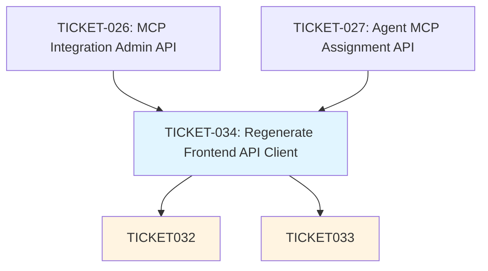

# Frontend Implementation Tickets Overview

## Summary

**Total frontend tickets:** 3
**Complexity breakdown:**
- Small: 1 (TICKET-034)
- Medium: 1 (TICKET-033)
- Large: 1 (TICKET-032)

**Implementation order:** TICKET-034 → TICKET-032, TICKET-033 (parallel)

## Dependency Graph



## Tickets by Category

### Foundation (API Client Generation)
**TICKET-034: Regenerate Frontend API Client** (Small)
- Dependencies: TICKET-026, TICKET-027
- Generate TypeScript API client from OpenAPI spec using Orval
- Creates hooks for all MCP integration endpoints
- Prerequisite for all UI implementation
- Deliverables:
  - 14 generated API hooks (10 admin endpoints, 4 agent endpoints)
  - TypeScript types for all DTOs
  - Verified build with no type errors

### UI Layer (Admin Interface)
**TICKET-032: Implement MCP Integration Admin UI** (Large)
- Dependencies: TICKET-034
- Organization admin interface for managing MCP integrations
- Full CRUD operations (create, read, update, delete, enable/disable, validate)
- Complex forms with dynamic validation
- Deliverables:
  - List/table view of all integrations
  - Create predefined integration dialog
  - Create custom integration dialog
  - Edit integration dialog
  - Delete confirmation dialog
  - Validation result display
  - Authorization checks for admin-only access
  - Unit tests for all components and validation logic

### UI Layer (Agent Configuration)
**TICKET-033: Implement Agent MCP Assignment UI** (Medium)
- Dependencies: TICKET-034
- User interface for assigning integrations to agents
- Simple toggle pattern for assignment/unassignment
- Optimistic updates for immediate feedback
- Deliverables:
  - MCP Integrations card on agent config page
  - List of available enabled integrations
  - Toggle switches for assignment
  - Optimistic updates with rollback on error
  - Empty state and error handling
  - Unit tests for component behavior

## Implementation Strategy

### Phase 1: Foundation (TICKET-034)
1. Ensure backend is running with MCP endpoints implemented
2. Run Orval code generation: `npm run openapi:update`
3. Verify all hooks and types are generated
4. Verify build succeeds with no type errors
5. **Estimated time:** 30 minutes - 1 hour

### Phase 2: UI Implementation (TICKET-032 & TICKET-033 - Parallel)
After TICKET-034 is complete, both UI tickets can be implemented in parallel by different developers or in any order.

**TICKET-032 (Admin UI):**
- More complex due to multiple forms and CRUD operations
- Requires careful form validation and error handling
- Need to implement authorization checks
- **Estimated time:** 2-3 days

**TICKET-033 (Agent Assignment UI):**
- Simpler implementation (single toggle pattern)
- Integrate into existing agent config page
- Need to implement optimistic updates
- **Estimated time:** 1-2 days

## Technical Patterns Used

### API Data Fetching
- **TanStack Query (React Query)** for all server state management
- Orval-generated hooks for type-safe API calls
- Automatic refetching and cache invalidation
- Optimistic updates for better UX

### Form Validation
- **Zod schemas** matching backend DTOs exactly
- Client-side validation before API calls
- Inline error display for form fields

### UI Components
- **shadcn/ui** components for consistent styling
- Card, Table, Dialog, Form, Button, Switch, Badge, etc.
- Responsive design patterns

### State Management
- TanStack Query for server state
- React hooks for local UI state
- Optimistic updates with automatic rollback on error

### Error Handling
- Toast notifications for all user actions
- Inline error display for form validation
- Graceful degradation with retry options

### Authorization
- Admin-only routes checked in UI (enforced by backend)
- Role-based rendering (hide/disable actions for non-admins)
- Context-based user info from auth system

## Frontend Architecture (FSD)

```
src/
├── features/
│   └── mcp-integrations/              # TICKET-032 (or in pages/)
│       ├── ui/
│       │   ├── mcp-integrations-page.tsx
│       │   ├── integrations-list.tsx
│       │   ├── create-predefined-dialog.tsx
│       │   ├── create-custom-dialog.tsx
│       │   ├── edit-integration-dialog.tsx
│       │   └── delete-confirmation-dialog.tsx
│       ├── model/
│       │   └── schemas.ts             # Zod validation schemas
│       └── lib/
│           └── helpers.ts
│
├── pages/
│   └── agents/
│       └── ui/
│           └── mcp-integrations-card.tsx  # TICKET-033
│
└── shared/
    └── api/
        └── generated/                 # TICKET-034 (Orval output)
            ├── mcp-integrations.ts    # Admin hooks
            └── agents-mcp.ts          # Agent assignment hooks
```

## Key Integration Points

### Backend Dependencies
- TICKET-026: Admin API endpoints for MCP integrations
- TICKET-027: Agent API endpoints for MCP assignment
- OpenAPI specification must be up-to-date

### Frontend Integration
- TICKET-034 must be completed before any UI work
- TICKET-032 and TICKET-033 are independent and can be built in parallel
- Both UI tickets use the same generated API hooks from TICKET-034

### Testing Requirements
All tickets include comprehensive unit tests:
- TICKET-034: Verify generated code (validation through build/typecheck)
- TICKET-032: Component tests, form validation tests, user interaction tests
- TICKET-033: Component tests, toggle behavior tests, optimistic update tests

## Success Criteria

### TICKET-034 Success
✅ API client generated successfully
✅ All hooks and types available
✅ Build passes with no errors
✅ No TypeScript errors

### TICKET-032 Success
✅ Admin UI accessible and functional
✅ All CRUD operations working
✅ Forms validate correctly
✅ Authorization enforced
✅ Tests passing

### TICKET-033 Success
✅ MCP Integrations card on agent page
✅ Toggle assignment working
✅ Optimistic updates implemented
✅ Error handling robust
✅ Tests passing

## Risk Assessment

### Low Risk
- TICKET-034: Simple code generation, well-defined process
- TICKET-033: Simple UI pattern, similar to existing features

### Medium Risk
- TICKET-032: Complex forms and validation logic
  - Mitigation: Use Zod schemas matching backend, thorough testing
  - Mitigation: Follow existing patterns from tools/prompts management

### Common Pitfalls to Avoid
1. **Forgetting to invalidate query cache** after mutations
2. **Not handling loading/error states** in UI
3. **Not implementing optimistic updates** for toggles
4. **Not matching Zod schemas to backend DTOs** exactly
5. **Not testing authorization** (admin-only access)
6. **Not providing user feedback** (toasts for all actions)
7. **Not handling edge cases** (empty states, no data, errors)

## Resources

### Documentation
- TanStack Query: https://tanstack.com/query/latest
- Zod: https://zod.dev/
- shadcn/ui: https://ui.shadcn.com/
- Orval: https://orval.dev/

### Existing Patterns to Reference
- Tools management UI (similar CRUD pattern)
- Prompts management UI (similar form validation)
- Agent config page (similar card layout for TICKET-033)

### Testing
- Vitest: https://vitest.dev/
- React Testing Library: https://testing-library.com/react
