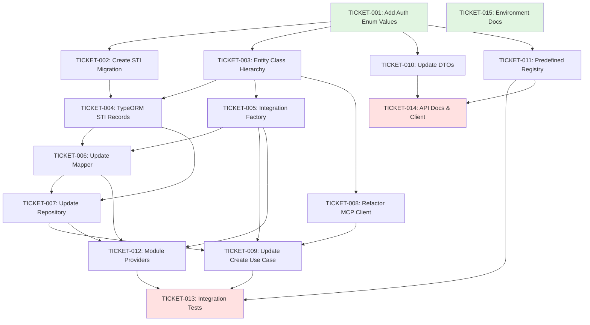

# Implementation Tickets Overview - Simplified MCP Authentication

## Summary

Total tickets: 15
Dependencies identified: 22
Estimated total effort: ~4-5 days

## Dependency Graph

## Implementation Phases

### Phase 1: Foundation (Day 1)
**Can be done in parallel:**
- TICKET-001: Add NO_AUTH and OAUTH to McpAuthMethod Enum (Small)
- TICKET-015: Update Environment Configuration Documentation (Small)

**Sequential after TICKET-001:**
- TICKET-002: Create TypeORM Migration for STI (Medium)
- TICKET-003: Refactor MCP Integration Entity Class Hierarchy (Large)

### Phase 2: Infrastructure Layer (Day 2)
**After Phase 1:**
- TICKET-004: Create TypeORM Records with STI (Medium)
- TICKET-005: Create MCP Integration Factory (Medium)
- TICKET-006: Update MCP Integration Mapper (Medium)
- TICKET-007: Update MCP Integration Repository (Medium)

### Phase 3: Application Layer (Day 3)
**Can be done in parallel after dependencies:**
- TICKET-008: Refactor MCP Client Service (Medium)
- TICKET-010: Update MCP Integration DTOs (Small)
- TICKET-011: Update Predefined Integration Registry (Small)

**After above:**
- TICKET-009: Update Create MCP Integration Use Case (Large)
- TICKET-012: Update MCP Module Providers (Small)

### Phase 4: Testing & Documentation (Day 4)
**After Phase 3:**
- TICKET-013: Add Integration Tests (Large)
- TICKET-014: Update API Documentation and Regenerate Client (Small)

## Tickets by Category

### Foundation (No Dependencies)
- TICKET-001: Add NO_AUTH and OAUTH to McpAuthMethod Enum
- TICKET-015: Update Environment Configuration Documentation

### Database Layer
- TICKET-002: Create TypeORM Migration for Single Table Inheritance (depends on: TICKET-001)

### Domain Layer
- TICKET-003: Refactor MCP Integration Entity Class Hierarchy (depends on: TICKET-001)
- TICKET-004: Create TypeORM Records with Single Table Inheritance (depends on: TICKET-002, TICKET-003)
- TICKET-005: Create MCP Integration Factory (depends on: TICKET-003, TICKET-004)

### Infrastructure Layer
- TICKET-006: Update MCP Integration Mapper (depends on: TICKET-004, TICKET-005)
- TICKET-007: Update MCP Integration Repository (depends on: TICKET-004, TICKET-006)
- TICKET-008: Refactor MCP Client Service for Polymorphic Auth (depends on: TICKET-003)
- TICKET-011: Update Predefined Integration Registry (depends on: TICKET-001)

### Application Layer
- TICKET-009: Update Create MCP Integration Use Case (depends on: TICKET-005, TICKET-007, TICKET-008)
- TICKET-010: Update MCP Integration DTOs (depends on: TICKET-001)
- TICKET-012: Update MCP Module Providers (depends on: TICKET-005, TICKET-006, TICKET-007)

### Testing & Documentation
- TICKET-013: Add Integration Tests for Simplified Auth Flow (depends on: TICKET-009, TICKET-011, TICKET-012)
- TICKET-014: Update API Documentation and Regenerate Client (depends on: TICKET-010, TICKET-011)

## Key Implementation Notes

1. **Single Table Inheritance**: The database will use TypeORM's `@TableInheritance` pattern with `auth_type` as discriminator
2. **Polymorphic Design**: Each auth type has its own entity class with specific behavior
3. **No OAuth Implementation**: OAuth class is a stub for future use
4. **Encryption**: Uses existing `McpCredentialEncryptionService` for token storage
5. **Connection Validation**: On-demand only, no automatic health checks
6. **Manual Token Updates**: No automatic refresh for Bearer tokens

## Risk Mitigation

- **No existing production data**: Confirmed no migrations needed
- **Direct cutover**: No feature flag, replacing existing simpler implementation
- **Testing approach**: Using production Locaboo with test account
- **Rollback plan**: Database migration can be reverted if needed

## Success Metrics

- ✅ Code complexity reduced by ~60%
- ✅ Clear separation of auth concerns via polymorphism
- ✅ Type-safe implementation with compile-time guarantees
- ✅ Extensible design for future auth methods
- ✅ All existing functionality preserved