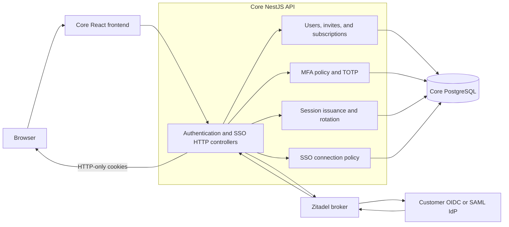
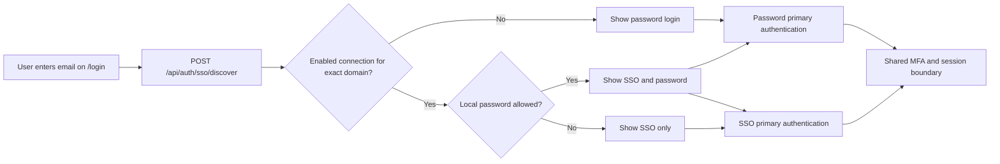
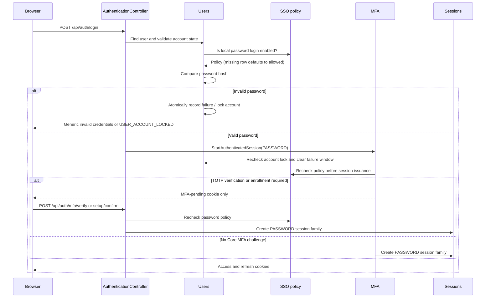
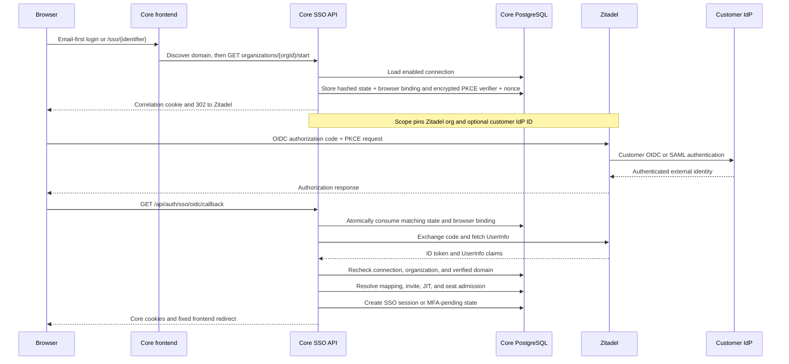
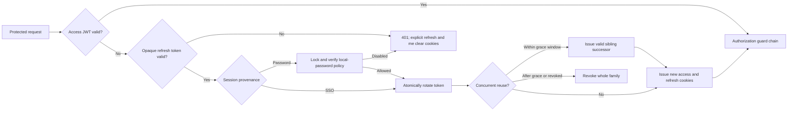
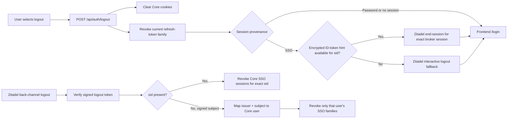
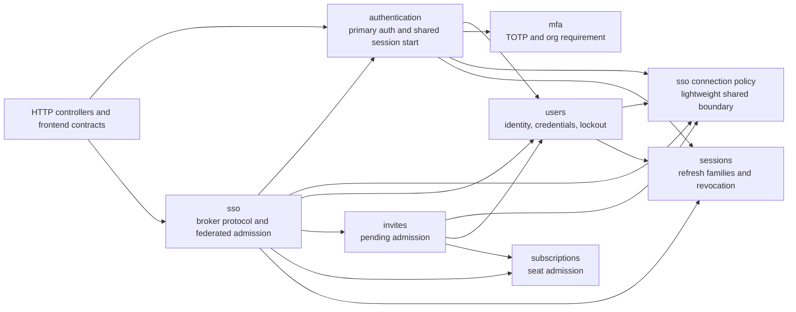

# Authentication architecture

This is the canonical map of Ayunis Core authentication. It describes the
runtime paths shared by local passwords, municipal SSO, Core MFA, session
refresh, account admission, and logout. For the operator procedure, see the
[Municipal SSO V1 runbook](../runbooks/municipal-sso-v1.md).

## Architectural rules

- Ayunis Core owns users, organization membership, roles, seats, sessions, and
  every authorization decision.
- Ayunis Core is one OIDC relying party of the Ayunis-managed Zitadel broker.
  A customer OIDC or SAML IdP is configured inside that customer's Zitadel
  organization. Core never talks to customer IdPs directly.
- One Zitadel organization maps to one Ayunis organization. Core pins both the
  organization and the verified email domain throughout the login transaction.
- SSO is additive by default. An organization may explicitly disable local
  password login only after its SSO connection is active and reviewed.
- Domain discovery improves routing; it does not authenticate the user. The
  callback is trusted only after OIDC, transaction, organization, and email
  claims have all been validated.
- Password and SSO authentication converge at one MFA-aware Core session
  boundary. Downstream authorization does not depend on the login method.
- The `AuthProvider` boot-time configuration currently selects the local
  authentication repository; the cloud option is not implemented. Municipal
  SSO runs alongside local authentication and does not use this mechanism.

## System context

Zitadel is an identity broker, not the Ayunis identity store. Its successful
authentication response is evidence used to find or create a Core user. The
Core `users.id` remains the subject of the access token and all application
data.

## Browser entry points

| Entry point | Purpose |
| --- | --- |
| `/login` | Email-first discovery, then password and/or SSO according to the organization policy. |
| `/sso/{identifier}` | Direct SSO start. `identifier` may be a verified domain or an Ayunis organization UUID. |
| `/two-factor` | Completes Core TOTP verification or forced enrollment after primary authentication. |
| `/sso/success` | Records a successful SSO organization in browser session storage, then continues to the saved internal path. |
| `/sso/error?code=...` | Displays a stable, non-sensitive SSO failure outcome. |
| `/password/forgot`, `/password/reset`, `/account/activate` | Local password recovery and initial-password paths. |
| `/accept-invite` | Local password-based invitation acceptance. SSO consumes the same pending invite during first login. |

For a domain identifier, the frontend discovers the connection by submitting a
synthetic address such as `sso@stadt.example`; no email is stored from this
lookup. With multiple verified domains, each domain is a valid direct URL and
routes to the same organization. There is currently no separate customer slug.

## Login routing

Discovery returns only whether SSO is available, the internal organization
UUID used to start it, and whether password login is allowed. The backend
rechecks all policy and mapping state later; hiding the password form is not a
security control.

After a successful SSO login, the frontend remembers the organization UUID in
`sessionStorage`. A later Core logout can therefore show **Sign in with SSO**
immediately instead of asking for the email again. This is a browser convenience
only: it is written after success, cleared by a successful password login or
**Use another account**, and never replaces server-side discovery or validation.

## Local password authentication

Important details:

- A null password hash is a federated-only user and cannot authenticate with a
  password.
- Failed password attempts are persisted per account. The default lockout is
  10 failures in 15 minutes; a locked account is rejected by password and SSO
  login until an authorized admin unlocks it.
- Password policy is checked before hashing and again under the session-issuance
  lock. A concurrent switch to SSO-only therefore cannot leak a new password
  session after the switch commits.
- Public login is also rate-limited per IP. This is separate from the persistent
  per-account lockout.

## SSO authentication

### Authorization and callback

The authorization request uses Authorization Code with PKCE and includes:

- random `state` and `nonce`;
- the configured callback URI;
- the pinned Zitadel organization scope;
- the optional Zitadel IdP scope for direct customer-IdP routing; and
- `max_age`, 24 hours by default.

The callback succeeds only when all of these are true:

1. The state appears exactly once and an unexpired, unconsumed transaction
   matches both its hash and the browser-binding cookie hash.
2. Core's OIDC client validates the authorization code, PKCE verifier, state,
   nonce, issuer, signature, audience, and `auth_time` against Zitadel.
3. UserInfo contains a subject, verified email, and Zitadel resource-owner
   organization ID.
4. The current enabled Core connection still matches the pinned Zitadel
   organization.
5. The verified email's exact normalized domain belongs to that connection.

The access token returned by Zitadel is used only inside the broker adapter to
fetch UserInfo. It is not persisted. The validated ID token is encrypted and
stored only as a short-lived logout hint keyed by Zitadel `sid`.

### User resolution and first-login admission

```mermaid
flowchart LR
  claims[Validated broker identity] --> mapped{issuer + subject mapped?}
  mapped -->|Yes| mappedUser[Load mapped Core user]
  mappedUser --> orgMatch{Same Core organization?}
  orgMatch -->|No| mismatch[Reject organization mismatch]
  orgMatch -->|Yes| admitted[Use existing Core user]

  mapped -->|No| emailUser{Core user with same email?}
  emailUser -->|Yes| localPolicy{Password login allowed?}
  localPolicy -->|Yes| explicit[Require explicit authenticated linking]
  localPolicy -->|No| auto[Auto-link after org and email checks]
  auto --> admitted

  emailUser -->|No| invite{Pending invite?}
  invite -->|Expired| expired[Reject expired invite]
  invite -->|Valid| invited[Consume invite and preserve its role]
  invited --> create[Create verified passwordless Core user]

  invite -->|No| jit{JIT enabled?}
  jit -->|No| inviteRequired[Reject: invitation required]
  jit -->|Yes| seat{Seat available?}
  seat -->|No| noSeat[Reject without partial user or identity]
  seat -->|Yes| jitUser[Create verified passwordless USER]
  jitUser --> create
  create --> link[Create federated identity mapping]
  link --> admitted
```

The user, identity mapping, and invite consumption are committed in one
transaction. Transaction-scoped advisory locks serialize the issuer/subject
and normalized email, and the database uniqueness constraint on
`(issuer, subject)` remains the final concurrency backstop.

Invitation and JIT rules are independent:

- A valid pending invite is accepted whether JIT is on or off and preserves
  its `USER`, `MANAGER`, or `ADMIN` role.
- An invite already reserved its seat when it was created, so SSO acceptance
  consumes that reservation instead of checking for an additional seat.
- An uninvited JIT user is always created as `USER`. In cloud seat-based
  deployments, admission is serialized and checks users plus pending invites
  against the active subscription before anything is created.
- With additive password login, an existing same-email account must use the
  authenticated link flow. With SSO-only enforced, the validated first login
  may link that account automatically so existing users are not stranded.

The backend retains `POST /api/auth/sso/link/start` and the purpose-bound link
callback. A link requires an already authenticated Core user with the same
organization and exact normalized verified email. The current frontend does
not expose this link action.

## Shared MFA and session boundary

Both primary authentication methods call `StartAuthenticatedSessionUseCase`.
This prevents password and SSO from developing different account-lock,
MFA, cookie, or refresh behavior.

| Evidence and Core state | Result |
| --- | --- |
| SSO ID token `amr` contains `mfa` | Broker MFA satisfies the Core login challenge. |
| SSO `amr` contains only `otp`, is absent, or is unknown | Continue with normal Core MFA evaluation. |
| User has confirmed Core TOTP | Require TOTP or a single-use recovery code. |
| Organization requires Core MFA and user has no confirmed TOTP | Force TOTP enrollment before issuing a session. |
| No user TOTP and no organization requirement | Issue the session immediately. |

When Core MFA is required, primary authentication produces only a signed,
HTTP-only `mfa_pending_token`; it does not produce an access or refresh token.
The pending token carries the user ID, whether enrollment is required, the
original authentication method, and the optional Zitadel session ID. It
expires after five minutes by default. MFA completion rechecks the SSO-only
policy for password-origin logins and creates a session with the original
provenance.

Core TOTP secrets are encrypted at rest. Recovery codes are hashed and consumed
atomically. Accepted TOTP counters can only move forward, preventing replay.

## Session lifecycle

| Artifact | Storage and purpose |
| --- | --- |
| `access_token` cookie | Signed JWT containing the Core user, organization, and roles. HTTP-only; one hour by default. |
| `refresh_token` cookie | Opaque random value. Only its SHA-256 hash is stored. Seven days by default. |
| `refresh_tokens` rows | One row per token in a device/login family, including `password` or `sso` provenance, optional Zitadel `sid`, rotation state, and expiry. |
| `mfa_pending_token` cookie | Signed short-lived proof of primary authentication; never accepted by the normal JWT strategy. |
| SSO correlation cookie | Ten-minute browser binding for one authorization transaction. |
| Browser `sessionStorage` | Safe post-login path, pending SSO org, and remembered successful SSO org. It is UX state, not trusted identity state. |

Protected requests pass through the global `JwtAuthGuard`. If the access token
is missing or expired but the refresh cookie is present, the guard rotates the
refresh token, sets new cookies, injects the new access token into the current
request, and reruns JWT validation. `GET /api/auth/me` has the same access-token
then refresh-token behavior, while `POST /api/auth/refresh` exposes explicit
rotation. The explicit refresh and `me` paths clear unusable cookies after any
refresh failure; the guard clears them when it detects token reuse.

Rotation preserves authentication method and Zitadel session correlation.
Password sessions use the normal sliding refresh expiry. SSO families also have
a non-sliding absolute expiry capped by the broker reauthentication window.

### SSO-only cutover serialization

Password login, password-origin MFA completion, and password refresh all check
the organization policy before writing new session state. Session issuance
takes a shared lock on the SSO policy row. Enforcing SSO-only updates that row
and revokes all password-origin refresh families in the same transaction. The
database therefore serializes the two outcomes:

- session issuance commits first, then cutover revokes it; or
- cutover commits first, then session issuance observes the disabled policy and
  rolls back.

SSO-origin families are not revoked by this cutover. Re-enabling local password
login preserves existing password hashes but does not restore revoked sessions.

## Logout

`POST /api/auth/logout` is a single backend-owned route for both login methods.
It revokes Core first. Only an SSO-origin session receives a broker end-session
URL, which the frontend follows before Zitadel returns to `/login`.

The public back-channel endpoint accepts only a signed Zitadel logout token with
the expected issuer, audience, expiry, `jti`, logout event, and no nonce. A
`sid` revokes the exact session. Subject fallback resolves the federated mapping
and revokes only SSO families, never password families. Unknown identities and
repeated valid notifications are idempotent.

## Organization authentication policy

The Superadmin organization SSO tab is the only current management UI. Customer
admins cannot change these values.

| State | SSO login | Password login | Mapping changes |
| --- | --- | --- | --- |
| No connection row | Unavailable | Allowed by default | Create mapping. |
| Configured, disabled | Unavailable | Allowed | Allowed. |
| Enabled, additive | Available | Allowed | Disable SSO before changing domains or Zitadel organization. |
| Enabled, SSO-only | Available | Blocked at every password admission/session boundary | Restore password login before changing the direct IdP or disabling SSO. |

The independent controls are:

- verified email domains and Zitadel organization mapping;
- optional persisted Zitadel IdP ID for broker-page bypass (the current
  Superadmin form requires it for new configuration, while the API and database
  remain nullable for existing connections and diagnostic fallback);
- SSO enabled;
- JIT provisioning enabled; and
- local password login enabled.

Enabling SSO requires a canonical verified-domain row and Zitadel organization.
Disabling password login additionally requires the operator to confirm the
exact current domains, Zitadel organization, and direct-IdP value. The update is
conditional on that reviewed snapshot, so a concurrent remap fails instead of
activating an unseen policy. Database constraints also prevent an SSO-only
connection from being disabled.

The global broker client configuration is optional as one complete group:
`SSO_OIDC_ISSUER`, `SSO_OIDC_CLIENT_ID`, `SSO_OIDC_CLIENT_SECRET`,
`SSO_OIDC_CALLBACK_URL`, and `SSO_LOGIN_TRANSACTION_ENCRYPTION_KEY`. If any is
set, all are required. Customer IdP credentials and metadata live only in
Zitadel; Core and its database never receive them.

## Account and credential lifecycle

| Path | Authentication consequence |
| --- | --- |
| Self-registration | Creates a new organization and local `ADMIN`, then a password-origin Core session. Email verification may still gate protected routes. |
| Local invite acceptance | Creates a password user with the invited role. Rejected without consuming the invite when the organization is SSO-only. |
| SSO invite acceptance | Creates a verified passwordless user, preserves the invited role, and consumes the invite atomically with the identity mapping. |
| SSO JIT admission | Creates a verified passwordless `USER` after seat admission. |
| Forgot/reset password | Generic public response. No token or email is issued for passwordless users or SSO-only organizations. Redemption rechecks policy and revokes all user sessions. |
| Initial password | The explicit path that may add a first password to a passwordless user, but it is unavailable while the organization is SSO-only. |
| Authenticated password change | Requires the current password and revokes other Core session families; the actor's current family survives when identifiable. |
| Account unlock | Organization admin or platform superadmin clears persistent password-failure state; neither may unlock itself. |
| User or organization deletion | Cascades to federated identities, refresh sessions, SSO transactions, broker-session hints, and MFA state. |

## Persistence map

| Table | Authentication responsibility | Sensitive value handling |
| --- | --- | --- |
| `users` | Core identity, organization, roles, email verification, nullable password hash, and account-lock state. | Passwords are one-way hashes. |
| `org_sso_connections` | One connection per Core org; broker IDs and runtime policy switches. | Contains no customer IdP credentials. |
| `org_sso_email_domains` | Globally unique, normalized verified domains used for discovery and callback validation. | Non-secret routing data. |
| `federated_identities` | Unique broker `(issuer, subject)` to Core `userId` mapping. | External subject never becomes a Core JWT subject. |
| `sso_login_transactions` | One-time state/browser hashes, pinned orgs, purpose, and callback material. | PKCE verifier and nonce are encrypted; rows expire after ten minutes. |
| `sso_broker_sessions` | Zitadel `sid` to encrypted ID-token logout hint. | Access and refresh tokens are never stored. |
| `refresh_tokens` | Opaque session family, provenance, rotation, revocation, and broker correlation. | Only token hashes are stored. |
| `org_mfa_requirements` | Organization-level Core MFA requirement. | Non-secret policy. |
| `user_totps` | User enrollment, replay counter, and MFA lockout state. | TOTP secret is encrypted. |
| `mfa_recovery_codes` | Single-use MFA recovery credentials. | Codes are one-way hashes. |
| `password_set_tokens` | Reset and initial-password links. | Only token hashes are stored and consumption is atomic. |
| `invites` | Pending organization admission and assigned role; also reserves a seat. | Invite links are signed separately. |

## Module ownership and dependency direction

`SsoConnectionPolicyModule` exists so Authentication, Users, and Invites can
consume an application-level policy use case without reaching into SSO
persistence. `SessionsModule` deliberately imports neither Authentication nor
Users, allowing both to depend on session operations without a NestJS cycle.
SSO receives the registered Authentication module dynamically and invokes the
exported shared session boundary after broker validation and admission.

After JWT authentication, `UserContextInterceptor` exposes the Core `userId`,
`orgId`, role, system role, and current refresh token to application use cases.
The global authorization guards then apply IP allowlist, email verification,
roles, permissions, add-ons, subscription, usage, academy, and rate-limit
policies in their declared order.

API keys are a separate machine-authentication path. Selected OpenAI-compatible
endpoints explicitly bind the bearer `api-key` Passport strategy, which yields
only `apiKeyId` and `orgId`; API keys do not enter password, SSO, MFA, or browser
session flows.

## Where to change or diagnose a path

| Concern | Primary location |
| --- | --- |
| Password login, JWT, MFA-pending state | `ayunis-core-backend/src/iam/authentication` |
| Broker protocol, discovery, linking, provisioning, logout | `ayunis-core-backend/src/iam/sso` |
| Refresh rotation and revocation | `ayunis-core-backend/src/iam/sessions` |
| Passwords, account lockout, reset/initial-password links | `ayunis-core-backend/src/iam/users` |
| TOTP and organization MFA | `ayunis-core-backend/src/iam/mfa` |
| Invite admission | `ayunis-core-backend/src/iam/invites` |
| Seat checks and allocation lock | `ayunis-core-backend/src/iam/subscriptions` |
| Login, SSO, two-factor, and account UI | `ayunis-core-frontend/src/pages/auth`, `src/features/sso`, and `src/pages/settings/account-settings` |
| Superadmin SSO management UI | `ayunis-core-frontend/src/pages/super-admin-settings/org` |
| Broker deployment and customer onboarding | `ayunis-core-auth`, `ayunis-infra`, and the operator runbook linked above |

When diagnosing a failed SSO login, follow the stages in order: connection
discovery, authorization transaction, broker callback validation, organization
and domain checks, user admission/linking, Core MFA, and session issuance. The
stable error code identifies the failed stage without exposing provider or
internal error messages to the browser.
